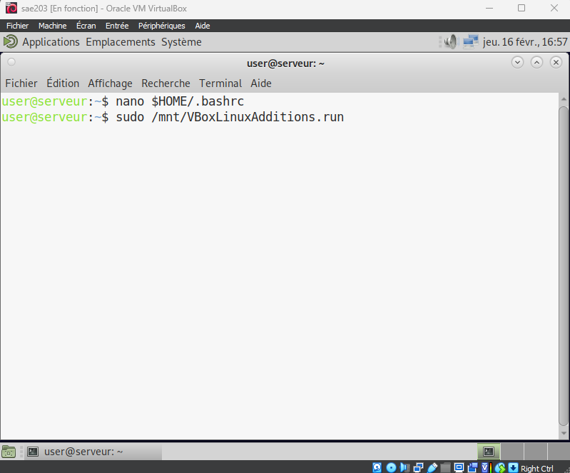
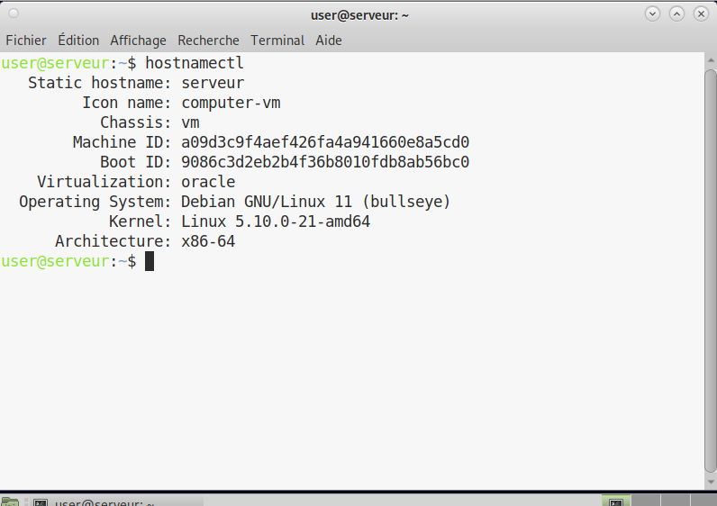
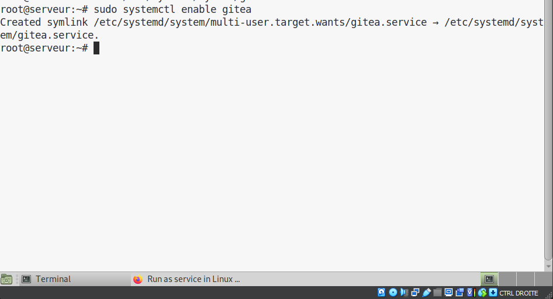
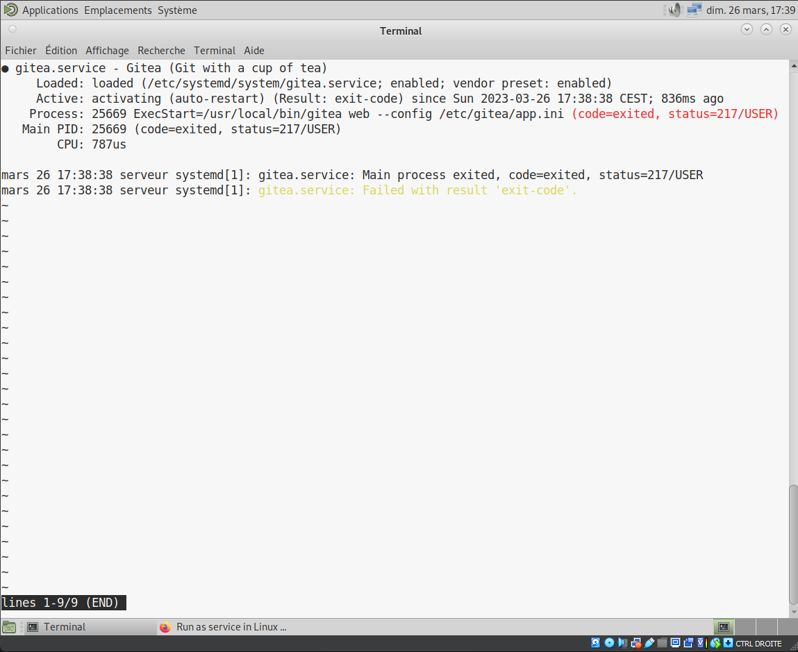

# SAE 2.03
Théo Vienne - Enzo Lamour - Gauthier Damblin

## Question(s) 1. Configuration matérielle dans VirtualBox
### Que signifie "64 bits" dans "Debian 64-bit"?
```
Il signifie que le stockage mémoire se fait sur 64bit a l'opposé d'un 32bit. Un systéme en 64 bit est plus puissant, plus rapide et stock plus de ram qu'un 32 bit? (4gb pour le 32bit, ce qui veut dire que tout ordinateur avec un OS 32bit et + de 4Go de ram aura de la ram inutile).
```
[Javatpoint](https://www.javatpoint.com/32-bit-vs-64-bit-operating-system#:~:text=Difference%20between%2032%2Dbit%20and,of%20a%2032%2Dbit%20processor.)

### Quelle est la configuration réseau utilisée par défaut ?
```
DHCP (Dynamic Host Configuration Protocol) pour une configuration automatique du réseau ip. Il donne automatiquement une addresse IP ainsi qu'un masque de sous réseau et une passerelle. 
```
[Microsoft](https://learn.microsoft.com/fr-fr/windows-server/networking/technologies/dhcp/dhcp-top)

### Quel est le nom du fichier XML contenant la configuration de votre machine ?
```
Le nom du fichier contenant la configuration de la machine est : config.xml. 
```

### Sauriez-vous le modifier directement ce fichier pour mettre 2 processeurs à votre machine ?
```
nano config.xml permet de modifier le fichier via l'editeur nano intégré.
```
## Question(s) 2. Installation OS de base
### Qu’est-ce qu’un fichier iso bootable ?
```
Un fichier disque avec les éléments de lancement de l'installation de l'OS
```
### Qu’est-ce que MATE ? GNOME ?
```
Des environnement de bureau qui permet d'avoir une interfaces graphique de l'ordinateur
```
### Qu’est-ce qu’un serveur web ?
```
Un serveur web est un ordinateur stockant les fichiers d'un serveur web (html, css, javascript). Ce serveur est accessible via un nom de domaine et envoie ces fichiers aux ordinateurs client, ce qui permet d'afficher le site. 
```
[Mozilla](https://developer.mozilla.org/fr/docs/Learn/Common_questions/Web_mechanics/What_is_a_web_server)
### Qu’est-ce qu’un serveur ssh ?
```
Un serveur qui met en lien des machines par protocole Secure Socket (ordinateur en terminal). Grâce au serveur ssh, on peut manipuler a distance une machine via un terminal afin de controler et echanger des fichiers. 
```
[linuxtricks](https://www.linuxtricks.fr/wiki/ssh-installer-et-configurer-un-serveur-ssh)
### Qu’est-ce qu’un serveur mandataire ?
```
Un serveur mandataire (proxy en anglais) est un intermediaire entre deux hôtes pour faciliter ou surveiller leurs échanges. Il sert à filtrer, protéger ou cacher des informations. 
```
[avg](https://www.avg.com/fr/signal/proxy-server-definition#:~:text=Un%20serveur%20proxy%20est%20un,services%20Internet%20que%20vous%20utilisez.)

##  Question(s) 3. sudo
```
Pour mettre user dans le groupe sudo la commande est : adduser user sudo
```

### Comment peux-ton savoir à quels groupes appartient l’utilisateur user ?
```
Grâce à la commande 'groups' on peut voir que user est dans le groupe sudo 
```
## 3.2
### **installer les suppléments :**


##  Question(s) 4. Suppléments invités
### Quel est la version du noyau Linux utilisé par votre VM ? N’oubliez pas, comme pour toutes les questions, de justifier votre réponse.

```
C'est la version linux 5.10.0-21-amd64 car ce sont des modules à utiliser sur les ordinateurs AMD 64. Cela veut dire que la vm est sur 64 bits.
```
### À quoi servent les suppléments invités ? Donner 2 principales raisons de les installer.
``` 
Ils permettent d'optimiser le systéme d'exploitation ainsi que d'augmenter les performances.
```
[oracle](https://docs.oracle.com/cd/E26217_01/E35193/html/qs-guest-additions.html)

### À quoi sert la commande mount (dans notre cas de figure et dans le cas général) ?
```    
La commande mount permet de monter une clé usb ou un disque dure :
mount -t type device dir
        type correspond au système de fichiers du périphérique à monter.
        device correspond au fichier de la partition à monter.
        dir correspond au répertoire dans lequel sera monté le périphérique.
```
## 3.3
### **Pour une configuration générale :**

# Semaine 9 : 
##  1.2 Quelques Questions
### 1. Qu’est-ce que le Projet Debian ? D’où vient le nom Debian ?
```
Le projet Debian et de faire un système d'exploitation libre et qualicatif sous Unix.  L'idée d'un système libre de type Unix provient du projet GNU. Debian vient de la contraction des noms Debra et Ian Murdock, qui a fondé le projet.
```
[debian](https://www.debian.org/doc/manuals/debian-faq/basic-defs.fr.html#whatisfaq)
### 2. Il existe 3 durées de prise en charge (support) de ces versions : la durée minimale, la durée en support long terme (LTS) et la durée en support long terme étendue (ELTS). Quelle sont les durées de ces prises en charge ?
```
LTS : une durée de 5 ans
```
LTS : [debian](https://wiki.debian.org/LTS)
### 3. Pendant combien de temps les mises à jour de sécurité seront-elles fournies ? Nom générique, nom de code et version
```
la durée des mise à jour de sécurité son approximativement entre juillet 2024 à juin 2026
Nom générique : Debian11
nom de code : Bullseye
version : 11
```
[debian](https://wiki.debian.org/fr/LTS)
### 4. Combien de version au minimum sont activement maintenues par Debian ? Donnez leur nom générique (= les types de distribution).
```
14 versions de Debian :
Bookworm (à venir)
Bullseye Debian 11
Buster Debian 10
Stretch Debian 9
Jessie Debian 8
Wheezy Debian 7
Squeeze Debian 6.0
Lenny Debian GNU/Linux 5.0
Etch GNU/Linux 4.0
Sarge GNU/Linux 3.1
Woody GNU/Linux 3.0
Potato GNU/Linux 2.2
Slink GNU/Linux 2.1
Hamm GNU/Linux 2.0
```
[debian](https://www.debian.org/releases/index.fr.html)
### 5. Chaque distribution majeur possède un nom de code différent. Par exemple, la version majeur actuelle (Debian 11) se nomme Bullseye. D’où viennent les noms de code données aux distributions ?
```
Tout les noms Debian vienne d'un personne de Toy Story
```
[debian](https://wiki.debian.org/fr/DebianBuzz)
### 6. L’un des atouts de Debian fut le nombre d’architecture (~ processeurs) officiellement prises en charge. Combien et lesquelles sont prises en charge par la version Bullseye ?
```
9 arcitectures prisent en charge :
PC 64 bits (amd64)
ARM 64 bits (AArch64)
EABI ARM (armel)
ARM avec unité de calcul flottant (armhf)
PC 32 bits (i386)
MIPS (petit-boutiste)
MIPS 64 bits (petit-boutiste)
PowerPC 64 bits (petit-boutiste)
System z 
```
[debian](https://www.debian.org/releases/bullseye/)
### 7. Première version avec un nom de code
### ◦ Quelle a était le premier nom de code utilisé ?
```
C'est Debian Buzz le premier nom de code utilisé poiur la version Debian GNU/Linux 1.1
```
[debian](https://wiki.debian.org/fr/DebianBuzz)
### ◦ Quand a-t-il été annoncé ?
```
Elle a été publiée le 17 juin 1996
```
[debian](https://wiki.debian.org/fr/DebianBuzz)
### ◦ Quelle était le numéro de version de cette distribution ?
```
la version Debian GNU/Linux 1.1 pour éviter toute confusion avec un fabricant de cédérom qui avait nommé faussement 1.0 une version précédente.
```
[debian](https://www.debian.org/doc/manuals/project-history/project-history.fr.pdf)
### 8. Dernière nom de code attribué
### ◦ Quel est le dernier nom de code annoncée à ce jour ?
```
Le dernier nom de code annoncé est Bookworm
```
[debian releases](https://www.debian.org/releases/index.fr.html)
### ◦ Quand a-t-il été annoncé ?
```
Elle à été annoncé en 2022 
```

### ◦ Quelle est la version de cette distribution ?
```
une verison amilioré de Debian 11
```
[debian releases testings](https://www.debian.org/releases/testing/index.fr.html)

#  Semaine 10 et 11 :

##  1.1 Configuration globale de git


### Qu’est-ce que le logiciel git-gui ? Comment se lance-t-il ?
```
Git est un logiciel de gestion permettant l'accés et la distribution simple et rapide de différent projets. Git peut se lancer depuis un terminal via la commande "git [options]"
Pour configurer son identité: "git config --global user.name "nom de la personne"
Pour configurer son email: "git config --global user.email "email_address@example.com"
Pour creer un dépot git, il suffit de faire git init dans le dossier qui nous interesse.
```

```
Admettons que je souhaite faire de mon dossier toto et de tout ce qu'il y'a dedans mon dépot git. 
La marche à suivre est de me déplacer dans le dossier toto, en rentrant dans le terminal "cd /toto".
Ensuite, je fait "git init" et mon dépot est initialisé a partir de toto. Un dossier .git apparaitra, il permet de garder les traces des actions effectuées. 
```
[git](https://docs.gitlab.com/ee/gitlab-basics/start-using-git.html)

### Mêmes questions avec gitk.

```
gitk est le premier navigateur de dépot graphique. Il permet d'éxplorer l'historique d'un dépot et est fonctionnel sur tout les OS.

Pour le faire fonctionner, sur terminal, utilisez la commande gitk [options] [portée de revision] [chemin du dossier]
```
[gitk](https://git-scm.com/docs/gitk)

### Quelle sera la ligne de commande git pour utiliser par défaut le proxy de l’université sur tous vos projets git ?

##  2. Installation de Gitea
```
Installation de gitea :
```


### Qu'est ce que Gitea
```
Gitea est un logiciel de forge (gestion et maintenance de texte en collaboration). Il permet de gérer un dépot en collaboration pour des projets de développement de logiciels par example.
```
[Gitea homepage](https://gitea.io/en-us/)

### À quels logiciels bien connus dans ce domaine peut-on le comparer (en citer au moins 2) ?
```
On peut comparer Gitea à Github ou Gitlab qui se ressemble mais ont certains aspects pratiques qui différent. 
Gitlab est plus "entrepreneurial" que Gitea qui lui est plus simple d'utilisation. 
Github lui est plus complexe mais confére bien plus d'intégration de logiciel tierce, permettant, à celui qui le maitrise, une bien plus ample utilisation. 
```
[Gitea vs Gitlab](https://hostedgitea.com/article/gitea-vs-gitlab#:~:text=Both%20Gitea%20and%20Gitlab%20are,many%20companies%20also%20use%20Gitea.)

[Gitea vs Github](https://hailbytes.com/github-vs-gitea-a-quick-guide/#:~:text=Main%20Differences%3A&text=Github%20offers%20a%20large%20number,custom%20plugins%20and%20feature%20extensions.)
```
Pour créer le fichier gitea j'ai du me rendre dans /etc/systemd/system/gitea.service et copier coller le gitea.service venant de ce lien :
```
[github-gitea_service](https://github.com/go-gitea/gitea/blob/main/contrib/systemd/gitea.service)


```
La ligne de commande ci-dessous permet qu'au démarrage le service gitea ce lance.
```

###  **Status du service gitea :**


### Comment faire pour la mettre à jour sans devoir tout reconfigurer ? Essayez en mettant à jour vers la version 1.19.
```
Pour mettre gitea à jour, il faut télécharger la version souhaité et faire une backup. Dans le cas ou une migration de donné est necessaire Gitea la fera sans necessiter une reconfiguration de la part de l'utilisateur.
```
[Docs gitea](https://docs.gitea.io/en-us/upgrade-from-gitea/#upgrade-from-an-old-gitea)
